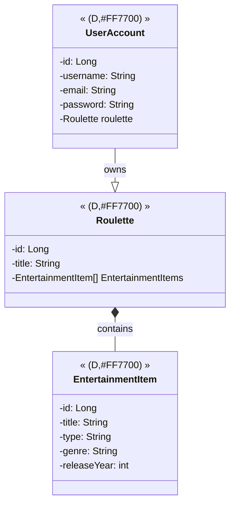

# Mocha Mix
Java RESTful API para o sistema de roletas Mocha Mix

## Diagrama de Classes

```mermaid
classDiagram
    class UserAccount {
        << (D,#FF7700) >>
        -id: Long
        -username: String
        -email: String
        -password: String
        -Roulette roulette
    }

    class Roulette {
        << (D,#FF7700) >>
        -id: Long
        -title: String
        -EntertainmentItem[] EntertainmentItems
    }

    class EntertainmentItem {
        << (D,#FF7700) >>
        -id: Long
        -title: String
        -type: String
        -genre: String
        -releaseYear: int
    }

    UserAccount --|> Roulette : owns
    Roulette *-- EntertainmentItem : contains
```
